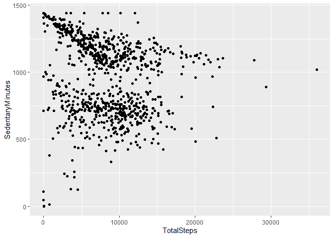
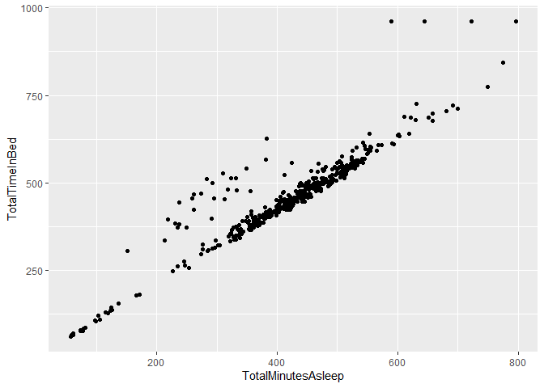
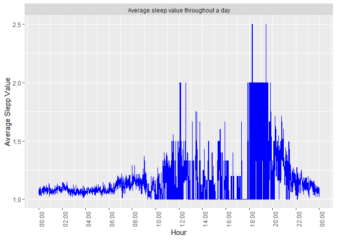
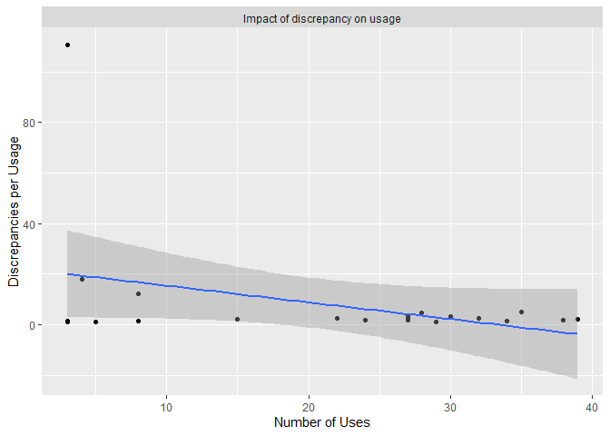

Bellabeat
================
Marcos Javier García Barrios
2023-02-07

## **Introduction**

The Bellabeat’s co-founder, Sršen, is aware that the analysis of
Bellabeat’s available consumption data should reveal new growth
opportunities for the company. She asked the marketing’s computational
data analysis team to concentrate on one Bellabeat’s product and analyze
the usage data of the smart devices in order to know how people actually
use their smart devices. Then, with these insights, she would like to
receive some high-level recommendations on how these tendencies could be
utilized in Bellabeat’s marketing strategies.

#### *Stakeholders:*

- Urška Sršen: Co-founder and Bellabeat’s Creative Director
- Sando Mur: Co-founder and Mathematician, key Bellabeat’s executive
  team member.

Sršen requested to analyze smart device usage data to determine how
consumers are using their smart devices that are not Bellabeat’s. Then,
she wants a single Bellabeat’s product to be selected to apply the
analysis insights to a presentation.

#### *Business Task:*

The main objective of this project is to know and study the habits of
use of smart devices like Fitness Tracker Data of the company FitBit ,
different from those of Bellabeat, by users. This project will reveal
the(s) trend(s) in these usage habits. Once these trends have been
identified, make the findings known and develop a recommendation for the
main stakeholders of this project (the co-founders of Bellabeat: Urška
Sršen and Sando Mur), in relation to one of the different Bellabeat
products that can take advantage of the area of opportunity that exists
in the habits of use of users, so that in this way a marketing strategy
can be formulated and implemented successfully.

## **Data Prepare**

Prior the clean and preparation, a data validation was conducted. The
data source is the outreach/community platform for Data Analysts:
“Kaggle”. This is a data set generated by responses in a survey
distributed via Amazon Mechanical Turk between 03.12.2016-05.12.2016;
manipulation and public use under the corresponding permits and
citations. Thirty eligible Fitbit users consented to the submission of
personal tracking data, including minute-level results for physical
activity, heart rate and sleep control. The variation between results
represents the use of different types of Fitbit trackers and individual
tracking behaviors/preferences.

For more detailed information about the data validation, please consult
the
[“Bellabeat_Prepare_MJGB”](https://docs.google.com/document/d/1AQujeIfU9bvYr88bJZirVxVO2nVcXG1gRrp13wEb5eg/edit?usp=sharing&resourcekey=0-tFB6Fu3uu99qBQjwWphvWg)
report.

### Setting up

To perform the data cleaning, we use the following packages:

``` r
library(tidyverse)
library(dplyr)
library(dbplyr)
library(knitr)
library(readr)
library(data.table)
```

As dataset, we will used the following .csv files from the original
source:

- dailyActivity_merged;
- heartrate_seconds_merged;
- minuteIntensitiesNarrow_merged;
- minuteMETsNarrow_merged;
- minuteSleep_merged;
- sleepDay_merged

*IMPORTANT: the current data has only 33 users activities from 4/12/2016
to 5/11/2016. This is not enough to represent the entire group of users
whose ways of exercises may differ from season to season. Nevertheless,
methods used in the analysis can be carried over straight to larger
amount of data when available.*

### Data Clean

#### **Formatting dates** 

The dates provided in this dataset are too complex to be worked in a SLQ
environment. So we use R to convert them into a format that is more
suitable for the later analysis.

\*\*The heartrate_seconds_merged was modified before everything else in
order to match the units of the other data sets, went from seconds to
minutes; so the new data set is minutes_heartrate.

Setting work directory:

``` r
setwd("D:/JavviGabba/Documents/Data Analytics/Bellabeat/Data")
```

*Specifically we format the original date such as 4/12/2016 3:00:00 PM
as 2016-04-12 15:00:00.*

``` r
dailyActivity_merged <- read_csv("D:/JavviGabba/Documents/Data Analytics/Bellabeat/Data/dailyActivity_merged.csv") %>%
  mutate(ActivityDate = as.Date(ActivityDate, format = "%m/%d/%Y"))

minutes_heartrate <- read_csv("D:/JavviGabba/Documents/Data Analytics/Bellabeat/Data/minutes_heartrate.csv") %>%
  mutate(time = strftime(as.POSIXlt(time, format = "%m/%d/%Y %I:%M:%S %p")))

minuteIntensities_merged <- read_csv("D:/JavviGabba/Documents/Data Analytics/Bellabeat/Data/minuteIntensitiesNarrow_merged.csv") %>%
  mutate(ActivityMinute = strftime(as.POSIXlt(ActivityMinute, format = "%m/%d/%Y %I:%M:%S %p")))

minuteMETs_merged <- read_csv("D:/JavviGabba/Documents/Data Analytics/Bellabeat/Data/minuteMETsNarrow_merged.csv") %>%
  mutate(ActivityMinute = strftime(as.POSIXlt(ActivityMinute, format = "%m/%d/%Y %I:%M:%S %p")))

minuteSleep_merged <- read_csv("D:/JavviGabba/Documents/Data Analytics/Bellabeat/Data/minuteSleep_merged.csv") %>%
  mutate(date = strftime(as.POSIXlt(date, format = "%m/%d/%Y %I:%M:%S %p")))

sleepDay_merged <- read_csv("D:/JavviGabba/Documents/Data Analytics/Bellabeat/Data/sleepDay_merged.csv") %>%
  mutate(SleepDay = strftime(as.POSIXlt(SleepDay, format = "%m/%d/%Y %I:%M:%S %p")))
```

We want to see a preview of each data set that we just formatted.

``` r
head(dailyActivity_merged)
```

    ## # A tibble: 6 × 15
    ##           Id ActivityDate TotalSteps TotalDistance TrackerDistance
    ##        <dbl> <date>            <dbl>         <dbl>           <dbl>
    ## 1 1503960366 2016-04-12        13162          8.5             8.5 
    ## 2 1503960366 2016-04-13        10735          6.97            6.97
    ## 3 1503960366 2016-04-14        10460          6.74            6.74
    ## 4 1503960366 2016-04-15         9762          6.28            6.28
    ## 5 1503960366 2016-04-16        12669          8.16            8.16
    ## 6 1503960366 2016-04-17         9705          6.48            6.48
    ## # ℹ 10 more variables: LoggedActivitiesDistance <dbl>,
    ## #   VeryActiveDistance <dbl>, ModeratelyActiveDistance <dbl>,
    ## #   LightActiveDistance <dbl>, SedentaryActiveDistance <dbl>,
    ## #   VeryActiveMinutes <dbl>, FairlyActiveMinutes <dbl>,
    ## #   LightlyActiveMinutes <dbl>, SedentaryMinutes <dbl>, Calories <dbl>

``` r
head(minutes_heartrate)
```

    ## # A tibble: 6 × 3
    ##   time                        Id Value
    ##   <chr>                    <dbl> <dbl>
    ## 1 2016-04-12 01:00:00 2022484408    66
    ## 2 2016-04-12 01:01:00 2022484408    66
    ## 3 2016-04-12 01:02:00 2022484408    68
    ## 4 2016-04-12 01:03:00 2022484408    73
    ## 5 2016-04-12 01:04:00 2022484408    80
    ## 6 2016-04-12 01:05:00 2022484408    75

``` r
head(minuteIntensities_merged)
```

    ## # A tibble: 6 × 3
    ##           Id ActivityMinute      Intensity
    ##        <dbl> <chr>                   <dbl>
    ## 1 1503960366 2016-04-12 00:00:00         0
    ## 2 1503960366 2016-04-12 00:01:00         0
    ## 3 1503960366 2016-04-12 00:02:00         0
    ## 4 1503960366 2016-04-12 00:03:00         0
    ## 5 1503960366 2016-04-12 00:04:00         0
    ## 6 1503960366 2016-04-12 00:05:00         0

``` r
head(minuteMETs_merged)
```

    ## # A tibble: 6 × 3
    ##           Id ActivityMinute       METs
    ##        <dbl> <chr>               <dbl>
    ## 1 1503960366 2016-04-12 00:00:00    10
    ## 2 1503960366 2016-04-12 00:01:00    10
    ## 3 1503960366 2016-04-12 00:02:00    10
    ## 4 1503960366 2016-04-12 00:03:00    10
    ## 5 1503960366 2016-04-12 00:04:00    10
    ## 6 1503960366 2016-04-12 00:05:00    12

``` r
head(minuteSleep_merged)
```

    ## # A tibble: 6 × 4
    ##           Id date                value       logId
    ##        <dbl> <chr>               <dbl>       <dbl>
    ## 1 1503960366 2016-04-12 02:47:30     3 11380564589
    ## 2 1503960366 2016-04-12 02:48:30     2 11380564589
    ## 3 1503960366 2016-04-12 02:49:30     1 11380564589
    ## 4 1503960366 2016-04-12 02:50:30     1 11380564589
    ## 5 1503960366 2016-04-12 02:51:30     1 11380564589
    ## 6 1503960366 2016-04-12 02:52:30     1 11380564589

``` r
head(sleepDay_merged)
```

    ## # A tibble: 6 × 5
    ##           Id SleepDay   TotalSleepRecords TotalMinutesAsleep TotalTimeInBed
    ##        <dbl> <chr>                  <dbl>              <dbl>          <dbl>
    ## 1 1503960366 2016-04-12                 1                327            346
    ## 2 1503960366 2016-04-13                 2                384            407
    ## 3 1503960366 2016-04-15                 1                412            442
    ## 4 1503960366 2016-04-16                 2                340            367
    ## 5 1503960366 2016-04-17                 1                700            712
    ## 6 1503960366 2016-04-19                 1                304            320

#### **Remove duplicates** 

We use the ***duplicated function*** to perform a check-up o for
duplicates.

``` r
nrow(dailyActivity_merged[duplicated(dailyActivity_merged),])
## [1] 0
nrow(minutes_heartrate[duplicated(minutes_heartrate),])
## [1] 0
nrow(minuteIntensities_merged[duplicated(minuteIntensities_merged),])
## [1] 0
nrow(minuteMETs_merged[duplicated(minuteMETs_merged),])
## [1] 0
nrow(minuteSleep_merged[duplicated(minuteSleep_merged),])
## [1] 543
nrow(sleepDay_merged[duplicated(sleepDay_merged),])
## [1] 3
```

There are 543 duplicated rows for the minuteSleep_merged table and 3
duplicated rows for the sleepDay_merged table, and no duplicated rows
for the other tables. We now use the ***unique function*** to remove
duplicates:

``` r
minuteSleep_merged <- unique(minuteSleep_merged)
sleepDay_merged <- unique(sleepDay_merged)
```

#### **Looking for incomplete data** 

On a first glance at total METs in the minuteMETs_merged table, we saw
that the base METs is 10. There are 1440 minutes in a day, so the total
METs should always be at least 14400. Nevertheless, there are users
whose total METs do not add up to 14400. This indicates that there are
incomplete measurements in the dataset. The following query returns 31
instances where the records of a user’s METS were not recorded
throughout the day.

``` r
minuteMETs_merged %>%
  separate(ActivityMinute, c("date", "minute"), sep = " ") %>%
  group_by(Id, date) %>%
  filter(n() < 1440) %>%
  summarise(mins_recorded = n())
```

    ## # A tibble: 31 × 3
    ## # Groups:   Id [31]
    ##            Id date       mins_recorded
    ##         <dbl> <chr>              <int>
    ##  1 1503960366 2016-05-11          1260
    ##  2 1624580081 2016-05-12           960
    ##  3 1644430081 2016-05-11           720
    ##  4 1844505072 2016-05-12           660
    ##  5 1927972279 2016-05-12           960
    ##  6 2022484408 2016-05-12           900
    ##  7 2026352035 2016-05-12           960
    ##  8 2320127002 2016-05-12           900
    ##  9 2347167796 2016-04-29           360
    ## 10 2873212765 2016-05-12           960
    ## # ℹ 21 more rows

The minuteIntensities_merged has exactly the same incomplete instances.
This was confirmed by

``` r
all_equal(minuteMETs_merged %>%
            separate(ActivityMinute, c("date", "minute"), sep = " ") %>%
            group_by(Id, date) %>%
            filter(n() < 1440) %>%
            summarise(mins_recorded = n()), minuteIntensities_merged %>%
            separate(ActivityMinute, c("date", "minute"), sep = " ") %>%
            group_by(Id, date) %>%
            filter(n() < 1440) %>%
            summarise(mins_recorded = n()))
```

    ## [1] TRUE

Since we are not predicting what the users do in the rest of the day, we
will not include these data for daily aggregations later. The original
dailyActivity_merged table has 940 observations. Deleting 31 of them
results in a less than 5 percent loss of the data.

#### Aggregations 

We would like to have a summary of each user’s daily total calories,
Mets, and intensities in a single table. Although the original source
already merged these measures on a daily basis, we pointed out earlier
that some of the days contain incomplete data. We therefore aggregate
these measures from scratch, using the minute measurement tables. We
then merge these aggregations into the original dailyActivity_merged
table. The merged table will be named as the daily_summary table. These
are done with the more involved code:

``` r
daily_summary <- minuteIntensities_merged %>%
  separate(ActivityMinute, c("date", "minute"), sep = " ") %>%
  group_by(Id, date) %>%
  filter(n() == 1440) %>% #Incomplete records are dropped
  summarise(TotalIntensity = sum(Intensity)) %>% #sum up each user's daily intensity
  merge(x = dailyActivity_merged[-c(3:14)], #include into dailyActivity_merged table, where-c(3:12) drops unused columns
    by.x = c("Id", "ActivityDate"),
    by.y = c("Id", "date")) %>%
  merge(y = minuteMETs_merged %>%
          separate(ActivityMinute, c("date", "minute"), sep = " ") %>%
          group_by(Id, date) %>%
  summarise(TotalMETs = sum(METs)), #sum up each user's daily METs
    by.x = c("Id", "ActivityDate"),
    by.y = c("Id", "date"))
```

``` r
head(daily_summary, n = 10)
```

    ##            Id ActivityDate Calories TotalIntensity TotalMETs
    ## 1  1503960366   2016-04-12     1985            429     25241
    ## 2  1503960366   2016-04-13     1797            318     22859
    ## 3  1503960366   2016-04-14     1776            293     22589
    ## 4  1503960366   2016-04-15     1745            364     22190
    ## 5  1503960366   2016-04-16     1863            349     23694
    ## 6  1503960366   2016-04-17     1728            318     21972
    ## 7  1503960366   2016-04-18     1921            391     24433
    ## 8  1503960366   2016-04-19     2035            476     25883
    ## 9  1503960366   2016-04-20     1786            313     22716
    ## 10 1503960366   2016-04-21     1775            284     22577

We can now peek each user’s usage by

``` r
daily_summary %>%
  group_by(Id) %>%
  summarise(days_of_use = n()) %>%
  arrange(days_of_use)
```

    ## # A tibble: 33 × 2
    ##            Id days_of_use
    ##         <dbl>       <int>
    ##  1 4057192912           3
    ##  2 2347167796          17
    ##  3 8253242879          17
    ##  4 3372868164          19
    ##  5 6775888955          25
    ##  6 7007744171          25
    ##  7 6117666160          27
    ##  8 6290855005          27
    ##  9 8792009665          28
    ## 10 1503960366          29
    ## # ℹ 23 more rows

The distribution is quite uneven. Therefore tracking usage based on day
activity records is not ideal. Fortunately the distribution is much more
even among sleep device users. We count users’ logIds to determine the
number of uses.

``` r
usage <- minuteSleep_merged %>%
  group_by(Id) %>%
  summarise(num_of_use = n_distinct(logId)) %>%
  arrange(num_of_use)
```

    ## # A tibble: 24 × 2
    ##            Id num_of_use
    ##         <dbl>      <int>
    ##  1 2320127002          1
    ##  2 7007744171          2
    ##  3 1844505072          3
    ##  4 6775888955          3
    ##  5 8053475328          3
    ##  6 1644430081          4
    ##  7 4558609924          5
    ##  8 1927972279          8
    ##  9 4020332650          8
    ## 10 2347167796         15
    ## 11 8792009665         15
    ## 12 6117666160         22
    ## 13 7086361926         24
    ## 14 1503960366         27
    ## 15 4319703577         27
    ## 16 5577150313         27
    ## 17 2026352035         28
    ## 18 4702921684         29
    ## 19 4388161847         30
    ## 20 3977333714         32
    ## 21 6962181067         34
    ## 22 8378563200         35
    ## 23 5553957443         38
    ## 24 4445114986         39

Note that we only have 24 users’ (among 33) sleep records. According to
the distribution, we can evenly divide the users into H (high), M
(moderate), L (low), where users having 1-8 login records are counted as
L. Those having 15-27 logins are counted as M. Finally, users with 28-39
login records are counted as H:

``` r
usage <- usage %>%
  mutate(usage = case_when(
    num_of_use <= 9 ~ "L",
    num_of_use <= 27 & num_of_use >9 ~"M",
    num_of_use >= 27 ~"H"
  ))
```

    ## # A tibble: 24 × 3
    ##            Id num_of_use usage
    ##         <dbl>      <int> <chr>
    ##  1 2320127002          1 L    
    ##  2 7007744171          2 L    
    ##  3 1844505072          3 L    
    ##  4 6775888955          3 L    
    ##  5 8053475328          3 L    
    ##  6 1644430081          4 L    
    ##  7 4558609924          5 L    
    ##  8 1927972279          8 L    
    ##  9 4020332650          8 L    
    ## 10 2347167796         15 M    
    ## 11 8792009665         15 M    
    ## 12 6117666160         22 M    
    ## 13 7086361926         24 M    
    ## 14 1503960366         27 M    
    ## 15 4319703577         27 M    
    ## 16 5577150313         27 M    
    ## 17 2026352035         28 H    
    ## 18 4702921684         29 H    
    ## 19 4388161847         30 H    
    ## 20 3977333714         32 H    
    ## 21 6962181067         34 H    
    ## 22 8378563200         35 H    
    ## 23 5553957443         38 H    
    ## 24 4445114986         39 H

We are now ready for analysis.

## **Analysis**

### Plotting a few explorations

What’s the relationship between steps taken in a day and sedentary
minutes? How could this help inform the customer segments that we can
market to? E.g. position this more as a way to get started in walking
more? Or to measure steps that you’re already taking?

<!-- -->

What’s the relationship between minutes asleep and time in bed? You
might expect it to be almost completely linear - are there any
unexpected trends?

<!-- -->

What could these trends tell you about how to help market this product?
Or areas where you might want to explore further?

### Merging these two datasets together

``` r
combined_data <- merge(sleepDay_merged, dailyActivity_merged, by="Id")
```

Take a look at how many participants are in this data set.

``` r
n_distinct(combined_data$Id)
```

    ## [1] 24

Note that there were more participant Ids in the daily activity dataset
that have been filtered out using merge. Consider using ‘outer_join’ to
keep those in the dataset.

We first present the general trend of the users in the data. We will see
that the application has a normally distributed user types. Moreover,
the application helps users stay fit, and it handles intensities, METs,
and calories consistently. We then investigate what affects usage. This
is where we detected potential issues posed by the sleep data.

### General Trend

We first plot and compare the distributions of users’ average METs,
intensities, and calories, using the daily_summary table. The average
values are aggregated by the following code:

``` r
intesities_summary <- daily_summary %>%
  group_by(Id) %>%
  summarise(average_calories = mean(Calories),
            average_intensities = mean(TotalIntensity),
            average_METs = mean(TotalMETs))
```

``` r
calorie_distribution  <- intesities_summary  %>%
  select(Id, average_calories) %>%
    mutate(average_calories = case_when(
     average_calories <= 1500 ~ "<= 1500",
     average_calories <= 1800 & average_calories >1500 ~"1501 to 1800",
     average_calories <= 2100 & average_calories >1800 ~"1801 to 2100",
     average_calories <= 2400 & average_calories >2100 ~"2101 to 2400",
     average_calories <= 2700 & average_calories >2400 ~"2401 to 2700",
     average_calories <= 3000 & average_calories >2700 ~"2701 to 3000",
     average_calories <= 3300 & average_calories >3000 ~"3001 to 3300",
     average_calories > 3300 ~"X > 3300"
     )) %>%
  rename(range_calories = average_calories)

calorie_distribution  <- calorie_distribution  %>%
  group_by(range_calories)  %>%
  summarise(
    amount_Id = n(),
    percentage = amount_Id / 33 * 100)
```

<!-- -->

``` r
intensity_distribution  <- intesities_summary  %>%
  select(Id, average_intensities) %>%
    mutate(average_intensities = case_when(
     average_intensities <= 100 ~ "<= 100",
     average_intensities <= 200 & average_intensities >100 ~"101 to 200",
     average_intensities <= 300 & average_intensities >200 ~"201 to 300",
     average_intensities <= 400 & average_intensities >300 ~"301 to 400",
     average_intensities > 400 ~"X > 400"
     )) %>%
  rename(range_intensities = average_intensities)

intensity_distribution  <- intensity_distribution  %>%
  group_by(range_intensities)  %>%
  summarise(
    amount_Id = n(),
    percentage = amount_Id / 33 * 100)
```

<!-- -->

``` r
METs_distribution  <- intesities_summary  %>%
  select(Id, average_METs) %>%
    mutate(average_METs = case_when(
     average_METs <= 18000 & average_METs >15000 ~"15,000 to 18,000",
     average_METs <= 21000 & average_METs >18000 ~"18,001 to 21,000",
     average_METs <= 24000 & average_METs >21000 ~"21,001 to 24,000",
     average_METs <= 27000 & average_METs >24000 ~"24,001 to 27,000",
     average_METs > 27000 ~"27,000 to 30,000"
     )) %>%
  rename(range_METs = average_METs)

METs_distribution  <- METs_distribution  %>%
  group_by(range_METs)  %>%
  summarise(
    amount_Id = n(),
    percentage = amount_Id / 33 * 100)
```

<!-- -->

We see that the distributions are close to normal: they are mostly
peaked in the middle and start to descend as we move away from the
middle. This indicate that the application has a broad range of users.
Next, we plot the trends over the recorded days by aggregating the
daily_summary table.

### Calories, Intensities and METs Trends

``` r
trends_daily_summary <- daily_summary %>%
  group_by(ActivityDate) %>%
  summarise(average_calories = mean(Calories),
            average_intensities = mean(TotalIntensity),
            average_METs = mean(TotalMETs))
```

<!-- -->
<!-- -->
<!-- -->

We have two major observations here. First, the three trends are very
similar. This indicates that the application has a consistent way of
measuring and calculating these three parameters. For this reason, we
will be focusing on intensities from now on. Second, the trend goes
slightly up, meaning that the application does help users stay fit.

### Average intensity throughout a day

Next, we calculate and plot average minute intensities throughout the
day, aggregated by all users. Doing so allows us to see which time
period users tend to exercise or stay sedentary.


We see that most people exercise after noon and the intensity peaked in
the 17:00 - 20:00 window. This indicates that most users exercise after
work. So far we have only looked at users’ exercises pattern. It is time
to explore the sleep data.

### Sleep Patterns

We use the minuteSleep_merged table to aggregate and plot sleep start
times:  

<!-- -->

We do the same for sleep end times:  

<!-- -->

We see that most users wake up between 6 and 8 AM, and go to sleep
around 10 to 11 PM. There are no major differences in sleep patterns
among the H,M,L groups. So, what impacts usage frequency?

### What affects usage?

First, it is natural to guess users in the habit of more intense
exercises tend to use the device more. we now demonstrate that indeed
there is a moderate positive correlation between usage and overall
workout intensities:  

<!-- -->

Next, we present a factor that influences user experience negatively.

### The discrepancy

Our discovery of the potential issues originated from the difficulty to
interpret sleep values recorded in the dataset. Since there was no
information about sleep values, we tried plotting the average minute
sleep values throughout the day, aggregated by 24 users first:  

<!-- -->

We were puzzled that the graph looks pretty similar to the intensity
graph “Average intensity throughout a day” shown earlier. It is natural
to guess the higher the sleep value, the less deep the sleep is.
Nevertheless, the fact that the graph stretches throughout the entire
day led us to believe that there may be instances where exercise
intensities and sleep values were recorded simultaneously. We found out
this is indeed the case:

``` r
merge(x = minuteSleep_merged, y = minuteIntensities_merged, by.x = c("Id", "date"), by.y = c("Id","ActivityMinute")) %>% 
  filter(Intensity>0) %>%
  as_tibble()
```

    ## # A tibble: 1,612 × 5
    ##            Id date                value       logId Intensity
    ##         <dbl> <chr>               <dbl>       <dbl>     <dbl>
    ##  1 1503960366 2016-04-15 05:18:00     2 11402722600         1
    ##  2 1503960366 2016-04-15 07:41:00     2 11402722600         1
    ##  3 1503960366 2016-04-15 08:07:00     2 11402722600         1
    ##  4 1503960366 2016-04-15 08:08:00     2 11402722600         1
    ##  5 1503960366 2016-04-15 08:17:00     2 11402722600         1
    ##  6 1503960366 2016-04-15 08:18:00     2 11402722600         1
    ##  7 1503960366 2016-04-15 08:19:00     2 11402722600         1
    ##  8 1503960366 2016-04-15 09:09:00     2 11402722600         1
    ##  9 1503960366 2016-04-15 09:10:00     2 11402722600         1
    ## 10 1503960366 2016-04-16 03:22:00     2 11421831252         1
    ## # ℹ 1,602 more rows

The query returned 1612 recording where both sleep value and intensity
are not zero. We shall refer to these instances as discrepancies. Let us
plot the correlation between usage and discrepancy.

``` r
minuteIntensities_merged %>%
  merge(y = minuteSleep_merged, by.x = c("Id","ActivityMinute"), by.y = c("Id", "date")) %>%
  filter(Intensity != 0) %>%
  group_by(Id) %>%
  summarise(disc = n()) %>% #aggregate each user's discrepancies
  merge(y = usage,by.y = "Id") %>%
  mutate(disc_per_usage = disc/num_of_use) %>%
  ggplot(aes(x = num_of_use, y = disc_per_usage)) + 
  geom_point() +
  geom_smooth(method = lm) +
  xlab("Number of Uses") +
  ylab("Discrepancies per Usage") + 
  facet_wrap(~"Impact of discrepancy on usage")
```

<!-- -->

This indicates a negative impact of discrepancy on user experiences.

## **Recommended actions**

Overall the application successfully helped users maintain their
fitness, and the different parameters such as calories, METs, and
intensities were handled consistently. It was the sleep tracking
function which we think needs some improvements.

The issues are mainly two. First and foremost, intensity should be given
its context. Specifically intensities recorded during sleep should be
distinguished from those recorded otherwise. There can still be a
measure called total intensity that sums up to the two if preferable.
Moreover, the application should also warn its users that the sleep
tracking is on when they turn on the exercise tracking functions and
vice versa. It is easy to foresee the frustration users have when they
find the data report confusing or uninterpretable.

Second, to better track the trends of users’ sleep patterns, we think
sleep tracking data should be generated similarly as intensities and
METs data. METs and intensities are set at their base values when users
are inactive. We found out that the sleep values were only recorded when
the users log in. This could potentially skew the data when a user turns
on the sleep device at an unusual time. For example, the following
query:

``` r
minuteSleep_merged %>%
  filter(strftime(date, 
                  format = "%H:%m") <= '20:00' &
         strftime(date,
                  format = "%H:%m") >= '18:00') %>%
  distinct(Id)
```

    ## # A tibble: 4 × 1
    ##           Id
    ##        <dbl>
    ## 1 1644430081
    ## 2 5577150313
    ## 3 6117666160
    ## 4 8053475328

returns only four users who turned their sleep tracking on during
18:00 - 20:00 time period. Since no other users turned their sleep
tracking on during this period, when calculating average minute sleep
values, we saw a spike during this time period in Figure “Average
intensity throughout a day”.

On the other hand, the following query:

``` r
minuteIntensities_merged %>%
  filter(Intensity > 2 &
         strftime(ActivityMinute, 
                  format = "%H:%m") >= '00:00' &
         strftime(ActivityMinute,
                  format = "%H:%m") <= '02:00') %>%
distinct(Id)
```

    ## # A tibble: 8 × 1
    ##           Id
    ##        <dbl>
    ## 1 1644430081
    ## 2 3977333714
    ## 3 4020332650
    ## 4 5577150313
    ## 5 6775888955
    ## 6 7086361926
    ## 7 8583815059
    ## 8 8792009665

confirmed there were high intensities (\>=3) recorded during 12:00 AM -
2:00 AM period. Nevertheless, these instances did not produce spikes in
the 24-hour intensity plot “Average intensity throughout a day” as they
were neutralized by other users inactiveness recorded during this
period.

Finally, we acknowledge that the idea to also record intensities while
sleeping has its own merit. Doing so can detect potential health issues
for the users. For example, the following queries:

``` r
tmp <- minuteIntensities_merged %>%
  merge(y =
        minuteSleep_merged[-c(4)],
        by.x = c("Id", "ActivityMinute"),
        by.y = c("Id", "date")) %>%
  filter(Intensity > 2 &
         Id == "4020332650") %>%
  merge(y = minutes_heartrate,
        by.x = c("Id", "ActivityMinute"),
        by.y = c("Id", "time"))
```

``` r
colnames(tmp) <- c("Id", "ActivityMinute", "ActivityIntensity", "SleepValue", "HeartRate")
tmp
```

    ##            Id      ActivityMinute ActivityIntensity SleepValue HeartRate
    ## 1  4020332650 2016-04-16 01:32:00                 3          1       134
    ## 2  4020332650 2016-04-16 01:33:00                 3          1       136
    ## 3  4020332650 2016-04-16 01:34:00                 3          1       136
    ## 4  4020332650 2016-04-16 01:35:00                 3          1       137
    ## 5  4020332650 2016-04-16 01:36:00                 3          1       136
    ## 6  4020332650 2016-04-16 01:37:00                 3          1       136
    ## 7  4020332650 2016-04-16 01:38:00                 3          1       136
    ## 8  4020332650 2016-04-16 01:39:00                 3          1       138
    ## 9  4020332650 2016-04-16 01:40:00                 3          1       138
    ## 10 4020332650 2016-04-16 01:41:00                 3          1       137
    ## 11 4020332650 2016-04-16 01:42:00                 3          1       133
    ## 12 4020332650 2016-04-16 01:43:00                 3          1       133
    ## 13 4020332650 2016-04-16 01:44:00                 3          1       132
    ## 14 4020332650 2016-04-16 01:45:00                 3          1       132
    ## 15 4020332650 2016-04-16 01:46:00                 3          1       132
    ## 16 4020332650 2016-04-16 01:48:00                 3          1       133
    ## 17 4020332650 2016-04-16 01:49:00                 3          1       133
    ## 18 4020332650 2016-04-16 01:51:00                 3          1       128
    ## 19 4020332650 2016-04-16 01:52:00                 3          1       128
    ## 20 4020332650 2016-04-16 01:53:00                 3          1       127
    ## 21 4020332650 2016-04-16 01:54:00                 3          1       124
    ## 22 4020332650 2016-04-16 01:55:00                 3          1       125
    ## 23 4020332650 2016-04-16 01:56:00                 3          1       126
    ## 24 4020332650 2016-04-16 01:57:00                 3          1       133
    ## 25 4020332650 2016-04-16 01:58:00                 3          1       134
    ## 26 4020332650 2016-04-16 01:59:00                 3          1       133
    ## 27 4020332650 2016-04-16 02:00:00                 3          1       136
    ## 28 4020332650 2016-04-16 02:01:00                 3          1       136
    ## 29 4020332650 2016-04-16 02:02:00                 3          1       135
    ## 30 4020332650 2016-04-16 02:03:00                 3          1       131
    ## 31 4020332650 2016-04-16 02:04:00                 3          1       128
    ## 32 4020332650 2016-04-16 02:05:00                 3          1       127
    ## 33 4020332650 2016-04-16 02:06:00                 3          1       135
    ## 34 4020332650 2016-04-16 02:07:00                 3          1       137
    ## 35 4020332650 2016-04-16 02:08:00                 3          1       137
    ## 36 4020332650 2016-04-16 02:10:00                 3          1       134
    ## 37 4020332650 2016-04-16 02:11:00                 3          1       134
    ## 38 4020332650 2016-04-16 02:13:00                 3          1       134
    ## 39 4020332650 2016-04-16 02:14:00                 3          1       134
    ## 40 4020332650 2016-04-16 02:15:00                 3          1       134
    ## 41 4020332650 2016-04-16 02:16:00                 3          1       133
    ## 42 4020332650 2016-04-16 02:17:00                 3          1       133
    ## 43 4020332650 2016-04-16 02:18:00                 3          1       130
    ## 44 4020332650 2016-04-16 02:19:00                 3          1       121
    ## 45 4020332650 2016-04-16 02:24:00                 3          1       127
    ## 46 4020332650 2016-04-16 02:25:00                 3          1       135
    ## 47 4020332650 2016-04-16 02:26:00                 3          1       136
    ## 48 4020332650 2016-04-16 02:27:00                 3          1       136
    ## 49 4020332650 2016-04-16 02:28:00                 3          1       134
    ## 50 4020332650 2016-04-16 02:29:00                 3          1       135
    ## 51 4020332650 2016-04-16 02:30:00                 3          1       135
    ## 52 4020332650 2016-04-16 02:32:00                 3          1       130
    ## 53 4020332650 2016-04-16 02:33:00                 3          1       130
    ## 54 4020332650 2016-04-16 02:34:00                 3          1       132
    ## 55 4020332650 2016-04-16 02:35:00                 3          1       134
    ## 56 4020332650 2016-04-16 02:36:00                 3          1       134
    ## 57 4020332650 2016-04-16 02:37:00                 3          1       129
    ## 58 4020332650 2016-04-16 02:38:00                 3          1       121

``` r
rm(tmp)
```

indicate that this very user has abnormally high heart rate during her
sleep. We appreciate that the device can detect instances as these. The
device will work even better if it handles intensities more carefully.

## **Final Thoughts**

The major findings in this study are the following:

- First, the Bellabeat application has a broad range of users. This can
  be seen by the nearly normal distributions of user types presented in
  the General Trend Section.
- Second, the trend plots for calories, METs and intensities over the
  recorded days all have positive trend lines. This shows that the
  application does help its users stay fit.
- Third, the similarities between the trend plots showcase a strength of
  the application: it handles different measures such as calories, METs
  and intensities consistently. Another strength of the application is
  its massive heart rate data, which can be used to detect its users’
  potential health problems. Among these appreciations nevertheless, we
  spotted a potential flaw of the application, which is its sleep
  tracking function.

We find the values assigned to the sleep records confusing. There is no
clear indication if higher values means better sleep. On top of that,
there are quite a few instances where both activity intensities and
sleep values are detected simultaneously, resulting in possibly
incorrect records. We refer to those instances as discrepancies. We will
show that discrepancies have negative impact on user experience with
discrepancy. Finally, we proposed ways for improving the sleep tracking
function.
